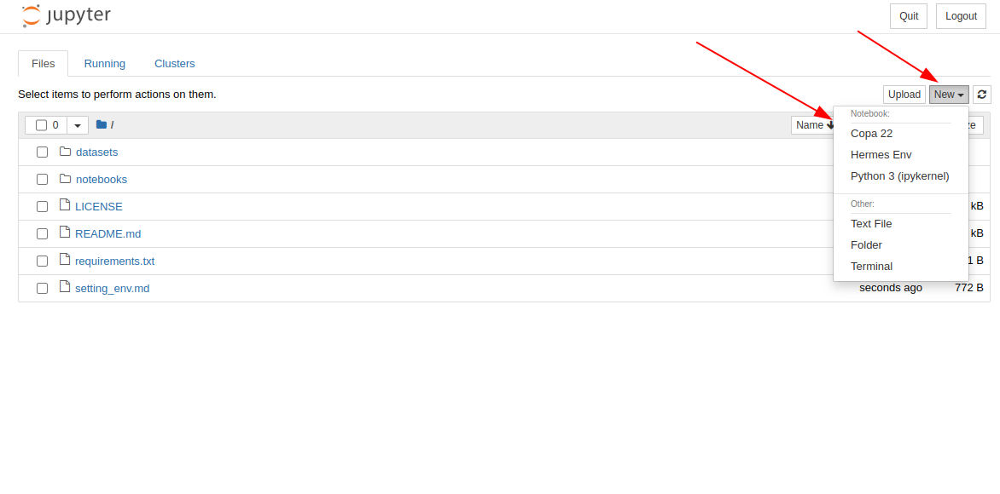

## Criando um ambiente virtual para trabalhar

Para trabalhar mais isoladamente, crie um ambiente virtual com pyenv, ative-o e instale as dependências com `pip install -r requirements.txt`. Elas incluem a biblioteca `ipykernel`, que será necessária para conseguir rodar notebooks jupyter dentro de ambientes virtuais. Feito isso, instale um Kernel para seu ambiente virtual com
```
python -m ipykernel install --user --name myenv --display-name "Python (myenv)"
```
Os nomes `myenv` e `"Python (myenv)"` são só sugestões. Veja mais detalhes [aqui](https://ipython.readthedocs.io/en/stable/install/kernel_install.html).

Feito isso, ao iniciar um notebook dentro do seu ambiente virtual com `jupyter notebook`. Ao abrir, escolha seu ambiente como na imagem abaixo. 



## Não consigo rodar na minha máquina?

Se você não consegue rodar na sua máquina e quer resolver isso depois, você pode tentar pelo Google Colab, mas téra que fazer upload dos datasets para o Google Drive para facilitar. Quando você abre um notebook lá, é possível montar seu google drive com alguns cliques.